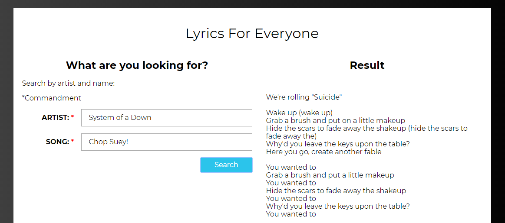

   

    
<h6 align = "center">SigmaΣCode</h6>

<h1 align="center">Song's Lyrics</h1>

 JavaScript application.

 

## Captures

    

## Features

- Use of Fetch API.
- Use of modules.
- Use of Async Await.
- Search songs lyrics from this API.

## See it online

- [`netlify`](https://songlyrics.netlify.com)
- [`codepen`](https://codepen.io/LeonAGA/pen/gOYJPem)

## Links to other proyects

- [`Final Fantasy VII Menu`](https://github.com/LeonAGA/Final_Fantasy_VII_Menu)
- [`BlackBoard`](https://github.com/LeonAGA/Blackboard)
- [`Agenda`](https://github.com/LeonAGA/Agenda)    
- [`Message Box`](https://github.com/LeonAGA/Message_Box_LocalStorage)   
- [`Expenses Account`](https://github.com/LeonAGA/Expenses_Account)  
                             
